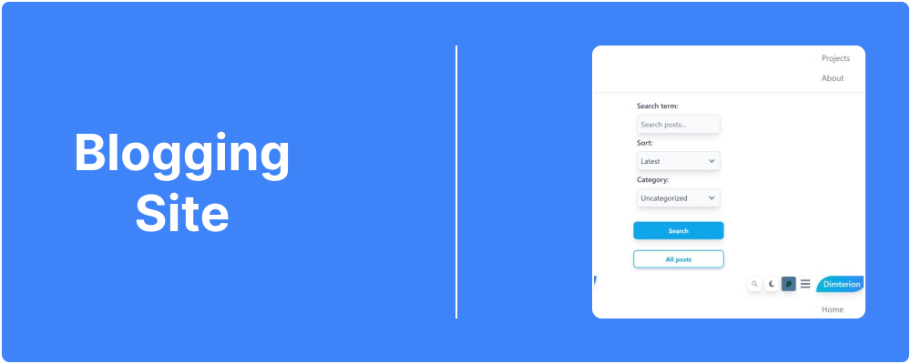

  

# Blogging Site

React / JavaScript application

## 📋 Table of Contents

- [Introduction](#introduction)
- [Features](#features)
- [Screenshots](#screenshots)
- [Tech Stack](#tech-stack)
- [Live Version](#live-version)
- [Contact Info](#contact-info)

## 🔠Introduction

Blogging site is a full-stack platform displaying various posts, projects and users comments.

## 📌 Features

- Create account (standard or admin account)
- Google authentication or standard name/email/password sign up
- Manage account (edit user's profile picture/name/email/password + account deletion)
- Content management system (write/edit/delete posts and comments)
- Monitor blog statistics (view number of users/posts/comments)
- Search for posts based on search terms and/or category (+ sort posts based on date)

## 📷 Screenshots

### Recent posts

**Caption:** Section displaying recent posts.

### Account management

**Caption:** User's account management section.

## ⚙️ Tech Stack

- React
- React Router
- Redux
- Tailwind CSS
- Flowbite React
- Quill (initially used ReactQuill)
- Mongo DB
- Express
- Node.js
- Render

## 🔗 Live Version

### [Blogging Site](https://mern-blog-chsq.onrender.com/)

**Note:** Current live version takes a few minutes to load.

## 📫 Contact info

### Bio Link ⬇️

**Note:** Ctrl+Click (Windows/Linux) or Cmd+Click (macOS) the image to open link in a new tab.
